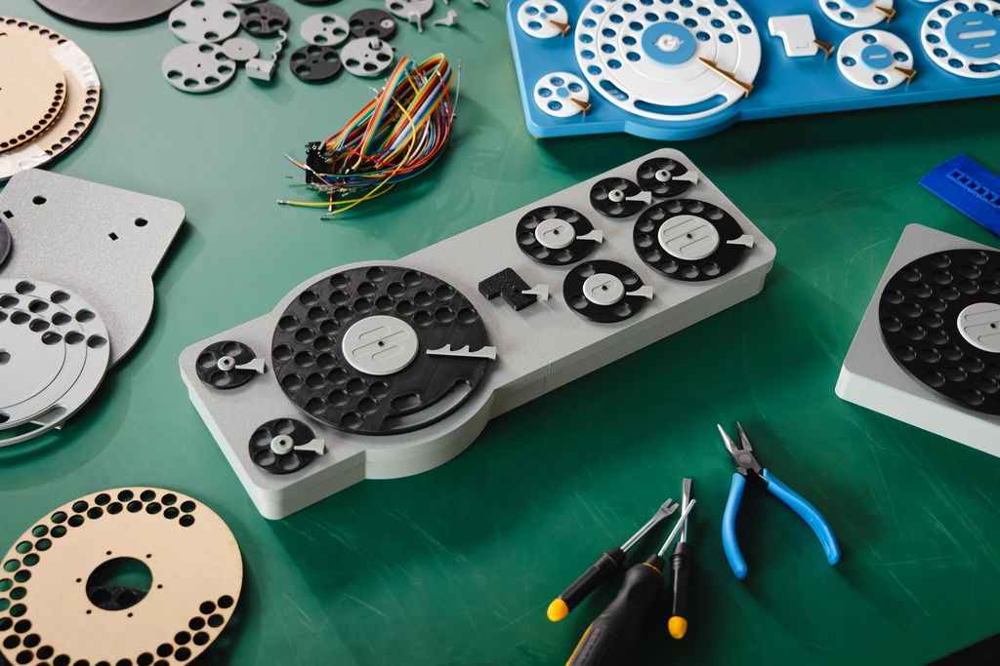

[Japanese version](./README_ja.md) is available.

# Gboard Dial Version

This directory contains the design data and firmware for the Gboard Dial Version, released on October 1, 2025.
The Gboard Dial Version is not an official Google product.

**We've made things well-rounded.**

"Keyboards are boring if you can only type on them."

In response to feedback from our users,

we have created a keyboard that you can turn.

The Gboard Dial Version,

realizing text input by rotation.

## Let's build it

This year again, we are releasing 3D printing model data, board data, and firmware.

[Click here for the build guide](./buildguide.md)

## There's also a non-rotating Gboard

For those who are accustomed to conventional typing input,

we also offer the standard version of Gboard.

It provides a comfortable input experience

in conjunction with various Google services

such as voice input and translation functions.

[Available on Google Play](https://play.google.com/store/apps/details?id=com.google.android.inputmethod.latin) 
[Available on the App Store](https://apps.apple.com/us/app/gboard-the-google-keyboard/id1091700242)

## [Other versions](https://github.com/google/mozc-devices)

## License

See [LICENSE](../LICENSE) file in this directory.
