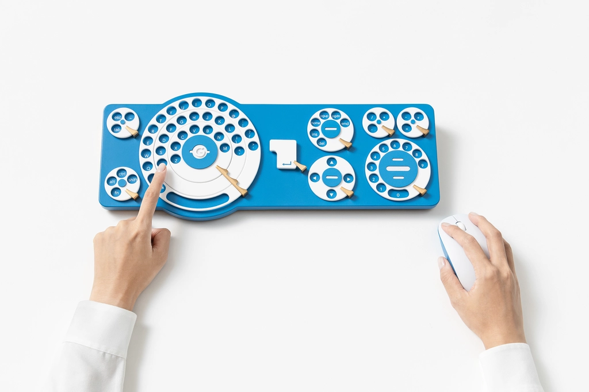

Gboard[English version](./README.md) is available.

# Gboard ダイヤルバージョン

このディレクトリは 2025 年 10 月 1 日にリリースされた Gboard ダイヤルバージョンの設計データとファームウエアを含んでいます。
Gboard ダイヤルバージョンは正式な Google 製品ではありません。

**まるくおさめました。**

「キーボードは打つだけじゃつまらない」

そんなユーザーのみなさまの声に応えて

まわす事ができるキーボードを作りました。

回転による文字入力を実現した、

Gboard ダイヤルバージョン

## 作ってみよう

今年も 3D プリント用モデルデータ、基板データ、ファームウエアを公開しています。

[ビルドガイドはこちら](./buildguide_ja.md)

## まわらないGboardもあります

いままでの打つ文字入力に慣れ親しんだ方には、

通常版の Gboard もご用意しております。

音声入力や翻訳機能など

Google の各種サービスと連携した

快適な入力体験を提供します。

[Google Play で公開中](https://play.google.com/store/apps/details?id=com.google.android.inputmethod.latin&hl=ja) 
[App Store で公開中](https://apps.apple.com/jp/app/id1091700242)

## [その他のバージョン](https://github.com/google/mozc-devices)

## ライセンス

このディレクトリに置かれた [LICENSE](../LICENSE) ファイルを参照してください。
