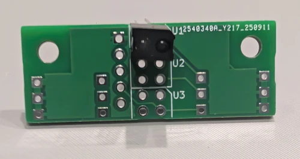
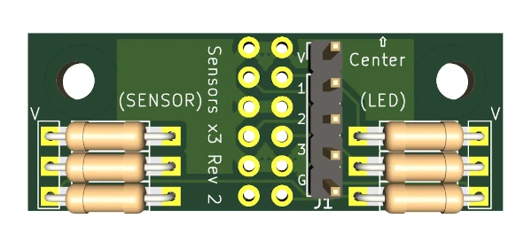
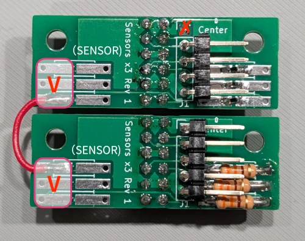
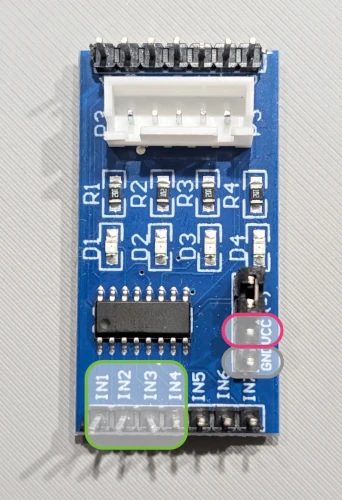
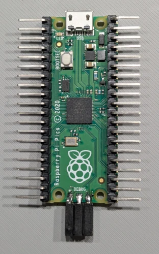
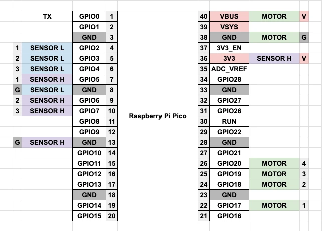
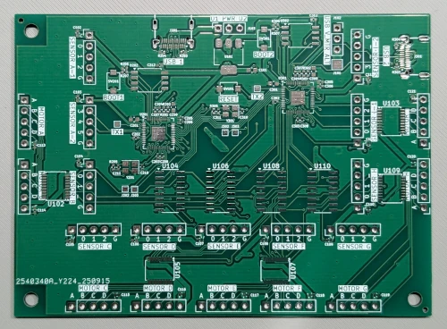

# Board Assembly Guide

For the entire keyboard assembly, please refer to the [Build Guide](../buildguide.md).

## Common to All Editions

### Sensor Board (per board)

#### Bill of Materials

| Ref | Description | Qty | Notes |
|---|---|---|---|
| R1,R3,R5 | Resistor 330Ω | 3 | Through-hole or surface-mount |
| R2,R4,R6 | Not populated | - | |
| U1-3 | Reflective photo sensor RPR-220 | 3 | (e.g., [Reflective Photo Sensor (Photoreflector) RPR-220](https://akizukidenshi.com/catalog/g/g111401/)) |
| J1 | 2.54mm pitch 1x5 pin header | 1 | L-shaped is desirable (e.g., [Pin Header (Male L-type) 1x40 (40P)](https://akizukidenshi.com/catalog/g/g101627/)) |

#### Assembly

This explanation covers the case where all 3 bits are populated. However, for the 9-dial edition, some sensors may only require 1 or 2 bits. In that case, populate only the required number of components from the top (U1). For details, follow the instructions for the 9-dial edition.

Also, before making everything, it is recommended to check if the Gray code plate values can be read properly to reduce rework in case of problems. If it doesn't work well, populate resistors on R2, R4, and R6. For details, see [Reading Sensor Adjustment](#reading-sensor-adjustment).

First, attach the photo sensors from the side where the U1, U2, and U3 markings are visible. Pay close attention to the orientation. The upper right corner is chamfered, so check the marking and the shape of the sensor to ensure they are in the same orientation. After correct placement, cut off the excess leads from the back and solder them.

On the back side, there are places to attach three resistors on the `(SENSOR)` side and three on the `(LED)` side, as shown in the figure. Both through-hole and chip resistors can be used, so use the parts of your choice. However, even for through-hole types, it is more stable to mount them without passing them through the holes when attaching the dial.

As mentioned earlier, the resistors depend on the adjustment, but it is recommended to leave the `(SENSOR)` side unpopulated and install 330Ω resistors on the `(LED)` side as a standard.

For the 1x5 pin header, using an L-shaped one will fit well in the case.

During assembly, pay attention to the `⇧Center` mark. The inner circumference of the dial will be in the direction of the arrow.

## 1-Dial Edition

This is an introductory edition that uses commercially available general-purpose parts other than the sensor board.

### Parts

- Raspberry Pi Pico: 1
- Sensor board (3-bit populated): 2
- [Unipolar Stepping Motor 28BYJ-48 5V](https://akizukidenshi.com/catalog/g/g113256/): 1
- [Stepping Motor Drive Module [M2003S]](https://www.aitendo.com/product/12366): 1
- Wiring materials: as needed

### Assembly

#### Sensor Board

Assemble two 3-bit populated sensor boards as described in the common section for all dial editions. We will call one `SENSOR L` and the other `SENSOR H`.

Although not a clean example as it was used for experiments, here are examples of mounting both through-hole and chip resistors.

Each board's pin header has five terminals: `V`, `1`, `2`, `3`, and `G`.
Of these, `V` connects to the 3.3V power supply, but the Raspberry Pi Pico we are using has only one 3.3V output terminal. Therefore, connect the terminal pair where `V` passes on the board, as shown by the red wiring in the photo.
In the diagram for the sensor board, the terminals inside the rectangle labeled `V`, that is, the six outer locations of the resistor patterns, are `V`.

The upper sensor board is `SENSOR L` for the inner circumference, and the lower sensor board is `SENSOR H` for the outer circumference.
Since `V` is interconnected, the `V` at the top-most, inner-most terminal is not needed for this connection.

#### Stepping Motor Drive Module

The Raspberry Pi Pico's GPIO cannot drive the motor directly, so the 1-dial edition uses a commercially available drive module. Any sink-type driver other than the one specified here will work, and you can also build your own by referring to the circuit of the 9-dial edition.

Taking the one mentioned here as an example, `IN1` to `IN4` enclosed in green are the terminals that receive the outputs `1` to `4` from the Raspberry Pi Pico. `GND` enclosed in black and `VCC` enclosed in red are `G` and `V` respectively.
The motor draws 5V power from the USB bus via the Raspberry Pi Pico. It requires about 0.3A, so the firmware for the 1-dial edition requests the 0.5A upper limit for USB micro.

The white terminal is used for connection with the stepping motor.

#### Raspberry Pi Pico

Attach L-shaped pin headers to a commercially available Raspberry Pi Pico as shown in the photo.
The three DEBUG pins at the bottom of the photo are optional and only needed if you need to develop and debug the firmware.

The pins used in the 1-dial edition are assigned as shown in the diagram. Connect to SENSOR L, SENSOR H, and MOTOR according to this diagram. When debugging, the standard output is output from TX via UART.

### Firmware Flashing

Follow the general method for the Raspberry Pi Pico. Connect the Raspberry Pi Pico to your PC while holding down the `BOOT` button on the board. A drive named `RPI-RP2` will appear. Copy `firmware/prebuilt/one_dial.uf2` into this drive. If the flashing is successful, the drive will disappear. Your OS may show a warning, but this is not a problem. From now on, when you connect this device to your PC without holding down the `BOOT` button, it will be recognized as a USB keyboard.

## 9-Dial Edition

### Parts

- Main board: 1
- Sensor board (3-bit populated): 6
- Sensor board (2-bit populated): 4
- Sensor board (1-bit populated): 1
- [Unipolar Stepping Motor 28BYJ-48 5V](https://akizukidenshi.com/catalog/g/g113256/): 9
- Wiring materials: as needed

### Main Board

#### Bill of Materials

| Ref | Description | Qty | Notes |
|---|---|---|---|
| C101 | Capacitor 10uF | 1 | |
| C102-121,C202-208,C212,C302-308,C312 | Capacitor 100nF | 36 | |
| C201,C209,C301,C309 | Capacitor 1uF | 4 | |
| C210,C211,C310,C311 | Capacitor 20pF | 4 | |
| J102-103 | 2.54mm pitch 1x3 pin header | 2 | |
| J106-J125 | 2.54mm pitch 1x5 pin header | 20 | |
| J201,J301 | USB TYPE C Receptacle | 2 | |
| R201-202,R301-302 | Resistor 27.4Ω | 4 | |
| R203-204,R303-304 | Resistor 5.1KΩ | 4 | |
| R205,R207,R305,R307 | Resistor 1KΩ | 4 | |
| R206,R306 | Resistor 10KΩ | 2 | |
| SW101,SW201,SW301 | Switch | 3 | |
| U101 | AMS1117 3.3V Regulator | 1 | |
| U102-103,U105,U107,U109 | TBD62083AFNG | 5 | |
| U104,U106,U108,U110 | 74HC238 | 4 | |
| U201,U301 | RP2040 | 2 | |
| U202,U302 | W25Q128JVS | 2 | |
| Y201,Y301 | 12MHz Crystal Oscillator | 2 | |
| N/A | Jumper pin | 2 | |

#### Assembly

Currently, we have released up to the schematics. We will release the Gerber data soon, so please look forward to it!

### Assembly

Attach 1x5 L-shaped pin headers for connecting to the sensor boards to `SENSOR A-L`, `SENSOR A-H`, `SENSOR B`, `SENSOR C`, `SENSOR D`, `SENSOR E`, `SENSOR F`, `SENSOR G`, `SENSOR H`, `SENSOR I-L`, and `SENSOR I-H`.

Attach 1x5 L-shaped pin headers for connecting to the motors to `MOTOR A`, `MOTOR B`, `MOTOR C`, `MOTOR D`, `MOTOR E`, `MOTOR F`, `MOTOR G`, `MOTOR H`, and `MOTOR I`.

Attach a 1x3 pin header to the location marked `U1 PWR U2` and short the `U1` and `PWR` positions with a jumper pin.

Attach a 1x3 pin header to the location marked `USB V_MTR ALT` and short the `USB` and `V_MTR` positions with a jumper pin.

### Sensor Board

Referring to the [Common to All Dial Editions](#common-to-all-dial-editions) section, prepare a total of 11 sensor boards with the following populated bit widths. There is no problem other than an increase in standby power consumption if you populate more bits, so it is also fine to prepare all of them with a 3-bit width.

| Ref | Populated Bit Width |
|---|---|
| SENSOR A-L | 3 |
| SENSOR A-H | 3 |
| SENSOR B | 2 |
| SENSOR C | 3 |
| SENSOR D | 2 |
| SENSOR E | 3 |
| SENSOR F | 3 |
| SENSOR G | 2 |
| SENSOR H | 2 |
| SENSOR I-L | 3 |
| SENSOR I-H | 1 |

## Photo Sensor Adjustment

The photo sensor readings should not vary greatly as they are taken inside the case, but differences may arise due to the brightness of the 3D printing material or the quality of the paper on which the Gray code is printed. If the dial reading is unstable or the rotation does not stop, the sensor value change range may not be within the expected range. In that case, please adjust the sensor paying attention to the following points.

### Reading with RP2040

The sensor value is processed as a digital value by GPIO. Therefore, it needs to be adjusted so that HIGH is in the range of 2.0 - 3.3[V] and LOW is in the range of 0.0 - 0.3[V] when operating at 3.3V.

### LED Sensor Adjustment

If the current flowing through the LED is small, the light emission will be weak, and the amount of light read by the sensor will be insufficient. This will result in higher readings, and the voltage difference between white and black will not be clear. In that case, try changing the three resistors on the `(LED)` side to weaker ones. The standard is adjusted with 330Ω, but with the photo sensor RPR-220 used this time, it will stay within the rated value even if you lower it to about 40Ω. However, it will greatly affect the standby power consumption, so if possible, please adjust with the resistor on the reading sensor side.

### Reading Sensor Adjustment

You can shift the read voltage value by changing the pull-up resistance of the reading sensor. However, if you change it too much, the voltage difference between white and black will become less clear. You can adjust it by populating the three resistors on the `(SENSOR)` side. The standard firmware expects a pull-up of about 50-80KΩ by the RP2040's pull-up. If the voltage does not rise sufficiently with black, it is better to pull-up more strongly with an additional resistor. By following the [Firmware Development Guide](../firmware/README.md) and disabling the RP2040's pull-up, the resistor populated here will become the pull-up resistor. If you do not disable it, it will be pulled up by the combined resistance in parallel. The calculation is a bit complicated, but it may be easier to pull-up in parallel with an additional resistor without changing the firmware if you want to pull-up more strongly.
