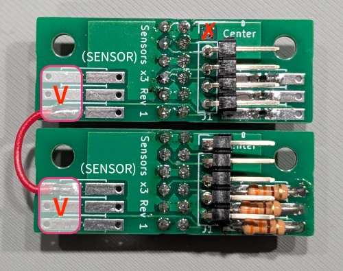
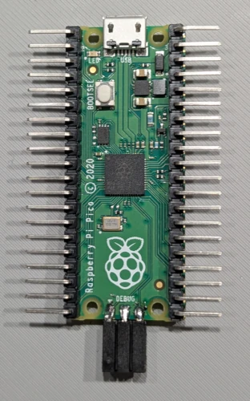
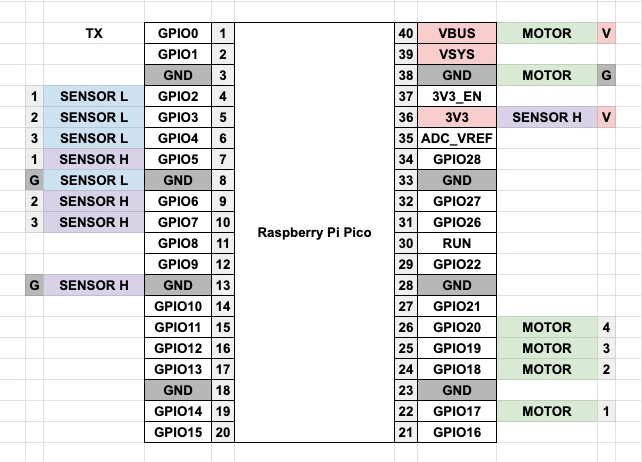
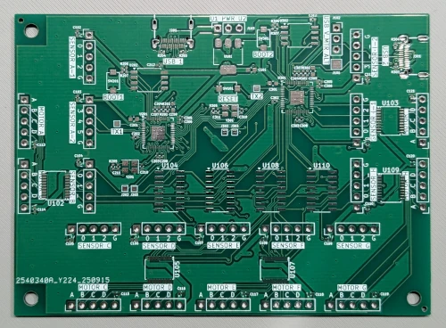

# 基板組立ガイド

キーボードの組み立て全体については[ビルドガイド](../buildguide_ja.md)を参照してください。

## 各ダイヤル版共通

### センサー基板（１枚あたり）

#### 部品表

参照名 | 内容 | 数 | 備考
-------- | -------------------- | --- | ---
R1,R3,R5 | 抵抗 330Ω | 3 | スルーホール用でも表面実装用でも可
R2,R4,R6 | 未実装 | - |
U1-3 | 反射型フォトセンサー RPR-220 | 3 | （例：[反射型フォトセンサー(フォトリフレクター) RPR-220](https://akizukidenshi.com/catalog/g/g111401/)）
J1 | 2.54mmピッチ 1x5 ピンヘッダー | 1 | L字のものが望ましい（例：[ピンヘッダー (オスL型) 1×40 (40P)](https://akizukidenshi.com/catalog/g/g101627/)）

#### 実装

この説明では3ビット分全て実装する場合について説明していますが、9ダイヤル版ではセンサーによっては1ビットまたは2ビット分の実装で良い場合があります。その場合は、上(U1)から順に必要な数だけ実装してください。詳しくは9ダイヤル版の説明に従ってください。

また、すべて制作する前に、実際にグレイコード板の値が適切に読み取れるか確認し、問題がない事を確認してから作ると万が一の際の手間が軽減できます。うまくいかない場合にはR2,R4,R6に抵抗を実装します。詳しくは[読み取りセンサー調整](#読み取りセンサー調整)を確認してください。

まずはU1、U2、U3の印刷が見える方から、フォトセンサーを取りつけます。向きに十分気をつけて下さい。右上の角が面取りされているので、印刷面とセンサーの形状を見て、同じ向きになるよう設置してください。正しく設置したら、裏側から不要な足を切り取りハンダ付けします。

裏面はこの図のように`(SENSOR)`側に3つ、`(LED)`側に3つの抵抗を取り付けられるようになっています。抵抗はスルーホール用のものと、チップ抵抗と、いずれのタイプでも取り付けられるようになっているので、お好みいのパーツを使って取り付けてください。ただし、スルーホール用の物でも、穴には通さずに取り付けた方がダイヤル取り付け時に安定します。

抵抗については前述の通り調整に依存しますが、標準では`(SENSOR)`側は未実装、`(LED)`側に330Ωの抵抗を取り付ける事を推奨します。

また、1x5のピンヘッダーについては、L字の物を使うとケースにうまく収まります。

組立時には`⇧Center`マークに注意してください。ダイヤル内周側が矢印の方向になります。

## 1ダイヤル版

センサー基板以外は市販の汎用部品を使う入門版です。

### 部品

- Raspberry Pi Pico: 1個
- センサー基板（3bit実装）: 2個
- [ユニポーラー ステッピングモーター 28BYJ-48 5V](https://akizukidenshi.com/catalog/g/g113256/):
  1個
- [ステッピングモータドライブモジュール [M2003S]](https://www.aitendo.com/product/12366): 1個
- 配線材: 適宜

### 組み立て

#### センサー基板

各ダイヤル版共通で説明したセンサー基板を、3bit実装で2つ組み立てます。 1つを`SENSOR L`、もう1つを`SENSOR H`と呼ぶことにします。

実験時に使用したもので見本としては綺麗なものではありませんが、スルーホール型の抵抗とチップ抵抗それぞれの実装例がこちらになります。

それぞれに基板のピンヘッダーには`V`、`1`、`2`、`3`、`G`の5つの端子があります。
このうち`V`は3.3V電源へ繋ぐのですが、今回利用するRaspberry Pi
Picoには3.3V出力端子は1つしかありませんので、写真の赤い配線のように基板上で`V`が通っている端子ペアを接続します。
センサー基板の説明で上げた図において`V`と書かれた長方形の内側にある端子、つまり抵抗用パターンのうち外側の6箇所が`V`になっています。

上側のセンサー基板が`SENSOR L`で内周側、下側のセンサー基板が`SENSOR H`で外周側になります。
`V`を相互接続したので、一番上の最も内側にあたる端子の`V`は今回接続不要となります。

#### ステッピングモータドライブモジュール

Raspberry Pi
PicoのGPIOでは直接モーターをドライブできないため、1ダイヤル版では市販のドライブモジュールを流用します。シンクタイプのドライバなら今回指定したもの以外でも構いませんし、9ダイヤル版の回路を参考に自作する事も可能です。

今回参考に上げた物を例にすると、緑で囲んだ`IN1`〜`IN4`がRaspberry Pi
Picoからの出力の`1`〜`4`を受ける端子になります。黒で囲んだ`GND`と赤で囲んだ`VCC`がそれぞれ`G`と`V`です。
モーターの方はUSBバスから5Vの電源をRaspberry Pi
Pico経由で引き込みます。0.3Aくらい必要となるため、1ダイヤル版のファームウェアではUSB microでの上限である0.5Aを要求しています。

白い端子はステッピングモータとの接続に使います。

#### Raspberry Pi Pico

市販のRaspberry Pi Picoに対して、写真のようにL字のピンヘッダーを取り付けます。
写真で下の方にあるDEBUG用のピン3つについては、ファームウェアの開発とデバッグが必要な場合のみで構いませんので、お好みで取り付けてください。

1ダイヤル版で使うピンについては、図のような割り当てになっています。この図に従って、SENSOR L、SENSOR
H、MOTORと接続します。デバッグ時の標準出力をUARTから出力する場合はTXから出力されます。

### ファームウェア書き込み

Raspberry Pi Picoの一般的な方法に従います。Raspberry Pi
Pico基板上の`BOOT`ボタンを押しながらPCに接続すると`RPI-RP2`という名前のドライブが出現するので、`firmware/prebuilt/one_dial.uf2`をこのドライブの中にコピーします。正しく書き込みができた場合ドライブが消えます。OSによって警告が表示されますが問題ありません。これ以降、このデバイスを`BOOT`ボタンを押さずにPCに接続した場合は、USBキーボードとして認識されるようになります。

## 9ダイヤル版

### 部品

- メイン基板: 1個
- センサー基板（3bit実装）: 6個
- センサー基板（2bit実装）: 4個
- センサー基板（1bit実装）: 1個
- [ユニポーラー ステッピングモーター 28BYJ-48 5V](https://akizukidenshi.com/catalog/g/g113256/):
  9個
- 配線材: 適宜

### メイン基板

#### 部品表

参照名 | 内容 | 数
------------------------------------ | ----------------------- | ---
C101 | コンデンサ 10uF | 1
C102-121,C202-208,C212,C302-308,C312 | コンデンサ 100nF | 36
C201,C209,C301,C309 | コンデンサ 1uF | 4
C210,C211,C310,C311 | コンデンサ 20pF | 4
J102-103 | 2.54mmピッチ 1x3 ピンヘッダ | 2
J106-J125 | 2.54mmピッチ 1x5 ピンヘッダ | 20
J201,J301 | USB TYPE C Receptacle | 2
R201-202,R301-302 | 抵抗 27.4Ω | 4
R203-204,R303-304 | 抵抗 5.1KΩ | 4
R205,R207,R305,R307 | 抵抗 1KΩ | 4
R206,R306 | 抵抗 10KΩ | 2
SW101,SW201,SW301 | スイッチ | 3
U101 | AMS1117 3.3V レギュレーター | 1
U102-103,U105,U107,U109 | TBD62083AFNG | 5
U104,U106,U108,U110 | 74HC238 | 4
U201,U301 | RP2040 | 2
U202,U302 | W25Q128JVS | 2
Y201,Y301 | 12MHz Crystal Oscilator | 2
N/A | ジャンパーピン | 2

#### 実装

現在、回路図まで公開しています。近日中にガーバーデータを公開しますのでお楽しみに！

### 組み立て

`SENSOR A-L`、`SENSOR A-H`、`SENSOR B`、`SENSOR C`、`SENSOR D`、`SENSOR E`、`SENSOR F`、`SENSOR G`、`SENSOR H`、`SENSOR I-L`、`SENSOR I-H`それぞれに、センサー基板との接続に用いる1x5のL字型ピンヘッダを取り付けます。

`MOTOR A`、`MOTOR B`、`MOTOR C`、`MOTOR D`、`MOTOR E`、`MOTOR F`、`MOTOR G`、`MOTOR H`、`MOTOR I`についてはモーターとの接続に用いる1x5のL字型ピンヘッダを取り付けます。

`U1 PWR U2`と書かれた箇所に1x3のピンヘッダを取り付け、ジャンパーピンで`U1`と`PWR`の位置をショートします。

`USB V_MTR ALT`と書かれた箇所に1x3のピンヘッダと取り付け、ジャンパーピンで`USB`と`V_MTR`の位置をショートします。

### センサー基板

[各ダイヤル版共通](#各ダイヤル版共通)の説明を参照して、合計11個のセンサー基板をそれぞれ以下の実装ビット幅で用意します。多めに実装する分には待機時消費電力の増加以外は問題ないので、全てを3ビット幅で用意してしまっても問題はありません。

参照名 | 実装ビット幅
---------- | ------
SENSOR A-L | 3
SENSOR A-H | 3
SENSOR B | 2
SENSOR C | 3
SENSOR D | 2
SENSOR E | 3
SENSOR F | 3
SENSOR G | 2
SENSOR H | 2
SENSOR I-L | 3
SENSOR I-H | 1

## フォトセンサーの調整について

フォトセンサーの読み取り値は、ケース内での読み取りになるため大きな差は出にくいはずですが、3Dプリント素材の明るさの違いや、グレイコードを印刷した紙の質などによって違いが出てくる可能性があります。ダイヤルの読み取りが安定しない、回転が止まらないなどの症状が出ている場合にはセンサー値の変化範囲が想定内に収まっていない可能性がありますので、以下の点に注意してセンサーの調整をしてください。

### RP2040での読み取り

センサーの値はGPIOでデジタル値として処理しています。そのため、3.3V稼働時にHIGHは2.0 - 3.3[V]、LOWは0.0 -
0.3[V]の範囲に収まるよう調整されている必要があります。

### LEDセンサー調整

LEDに流れる電流が少ないと発光も弱くなり、センサーで読み取る光量も不足します。そのため、読み取り値が高くなり、白と黒で電圧差がはっきりとでなくなってきます。その場合、`(LED)`と書かれた側にある3つの抵抗を弱いものに変えてみてください。標準では330Ωで調整していますが、今回用いているフォトセンサーRPR-220では40Ωくらいまで下げても定格内に収まります。ただし、待機時の消費電力に大きく影響しますので、可能なら読み取りセンサー側の抵抗で調整してください。

### 読み取りセンサー調整

読み取りセンサーのpull-up抵抗値を変える事で、読み取る電圧値をシフトさせる事ができます。ただし、大きく変えすぎるとやはり白と黒の電圧差が出にくくなります。`(SENSOR)`と書かれた側にある3つの抵抗を実装する事で調整できます。標準のファームウェアではRP2040のpull-upにより、およそ50-80KΩでpull-upされる事を期待しています。黒で十分に電圧が上がらない場合は、追加の抵抗でより強くpull-upすると良いでしょう。[ファームウェア開発ガイド](../firmware/README_ja.md)に従いRP2040のpull-upを無効化すると、ここに実装した抵抗がそのままpull-up抵抗になります。無効化しない場合は並列接続での合成抵抗でpull-upする事になります。計算が少し煩雑ですが、より強くpull-upする分にはファームウェアを変えずに追加の抵抗で並列でpull-upする方が簡単かもしれません。
