# Build Guide

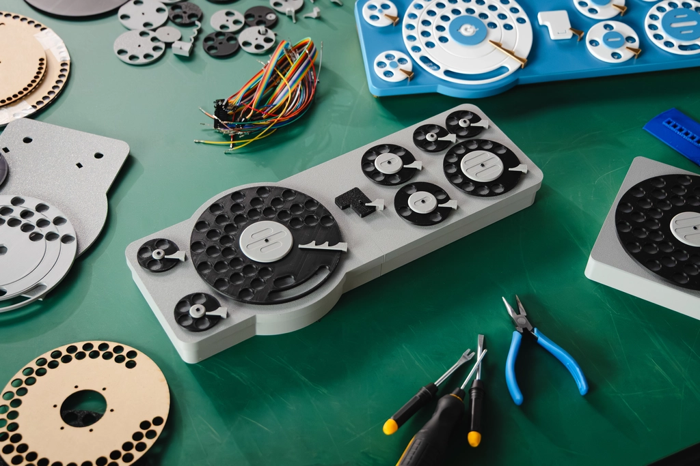

[Read the project overview first](./README.md)

## File List

- stls/ : STL files for the case
- stls/one_dial/ : For the 1-dial edition
- stls/full/ : For the 9-dial edition (Stay tuned!)
- pattern/ : Encoder pattern files
- board/ : KiCad schematics and board layout data
- board/gerber/ : Gerber data for PCB production and assembly
- firmware/ : Firmware development resources for Raspberry Pi Pico C/C++ SDK
- firmware/prebuilt : Pre-built firmware binaries

## Assembly

We have prepared a 1-dial edition, which is easier to assemble with only one dial, and a full edition with nine dials.

### 1-Dial Edition

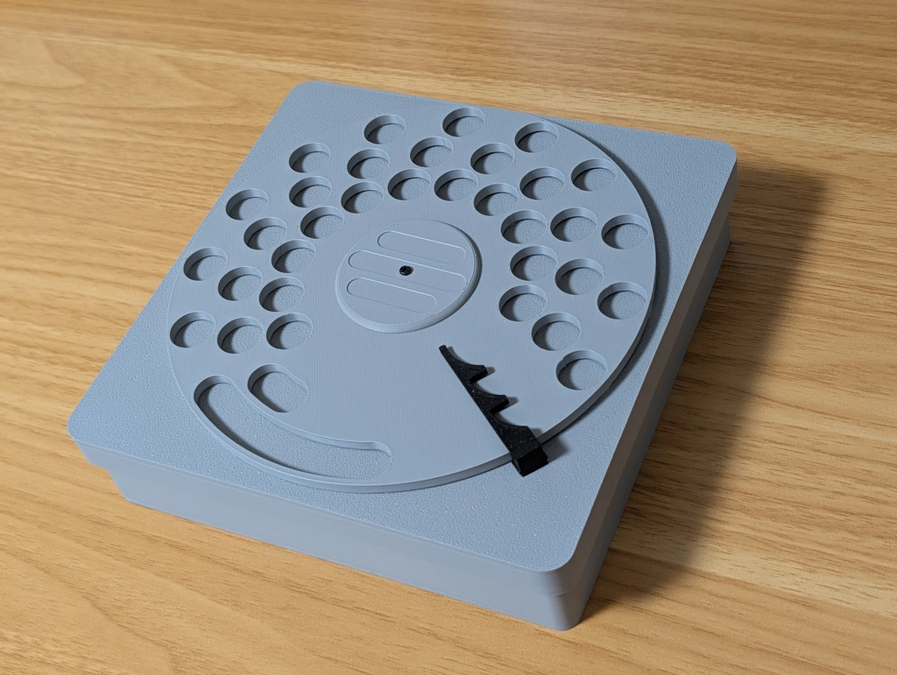

#### Required Parts

- 3D printed parts (1 of each)
  - Bottom case (case_bottom.stl)
  - Top case (case_top.stl)
  - Dial (dial.stl)
  - Dial cap (dial_cap.stl)
  - Encoder (encoder.stl)
  - Clutch (clutch.stl)
  - Fixing cover (cover.stl, print in a color close to white, such as gray)
  - Triple claw (end3.stl)
- Encoder pattern pattern/one_dial.svg
- Screws
  - 12 self-tapping screws, 2mm diameter, 4mm length
  - 2 washers
- Electronic parts ([see the board directory for details](./board/README.md))
  - 1 [Firmware installed](./firmware/README.md) Raspberry Pi Pico
  - 2 assembled sensor boards
  - 1 [Unipolar Stepping Motor 28BYJ-48 5V](https://akizukidenshi.com/catalog/g/g113256/)
  - 1 [Motor driver module](https://www.aitendo.com/product/12366)
  - Wiring materials: as needed

#### Step 1: Create the Encoder

Print the [pattern file](./pattern/one_dial.svg) on copy paper at actual size.
Place the encoder part on top with the printed side down, glue it, and cut around the perimeter and the center.

Align the ◆ mark on the encoder part with the ▼ mark on the paper.

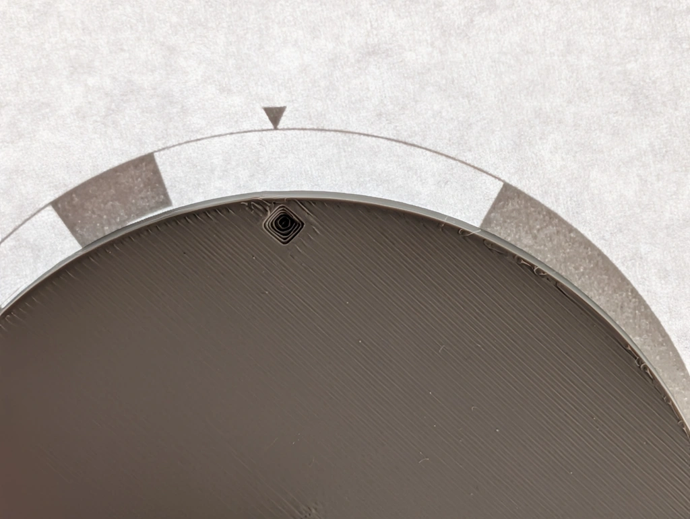

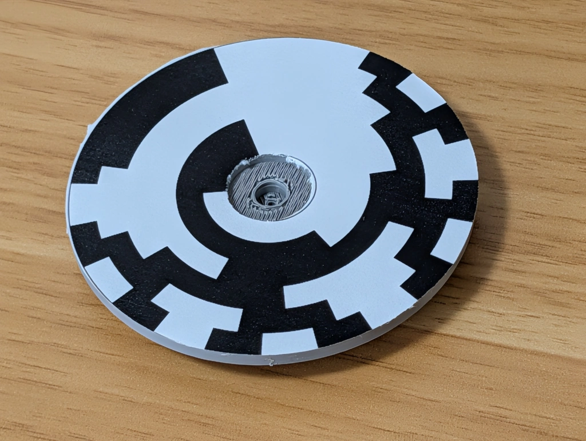

#### Step 2: Assemble the Cover Module

The cover needs to be printed in a non-transparent color because it uses a photosensor.
In the prototype, we used gray PLA.
You may need to adjust the resistance of the sensor board for other colors.

Screw the two sensor boards to the back.

Also, screw the stepping motor to the back.

We call the sensor board near the motor as "Sensor L" board and other one as "Sensor H" board.

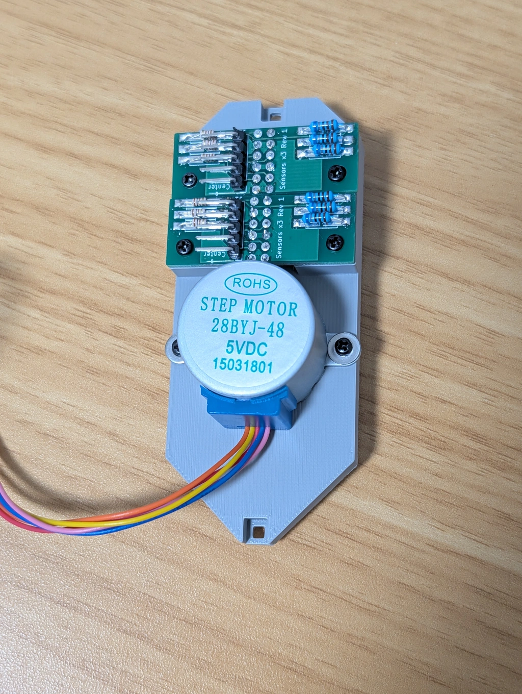

Attach the clutch to the motor shaft protruding from the front.

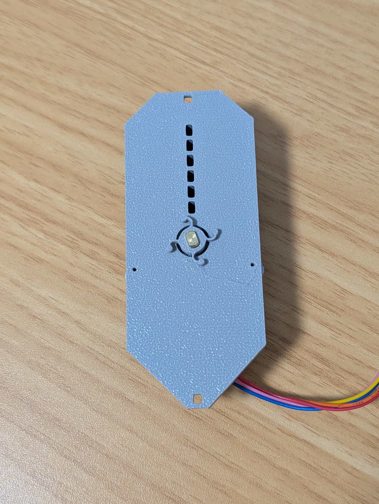

#### Step 3: Attach to the Case

From the back, attach the encoder and then the cover.
Refer to the photo below for the orientation of the cover.

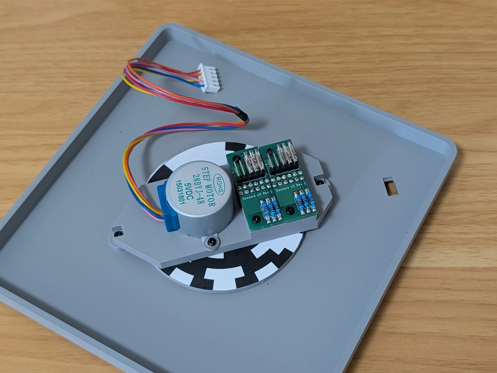

From the front, attach the dial and cap to the shaft.
There are small marks on the dial and shaft, so align them.

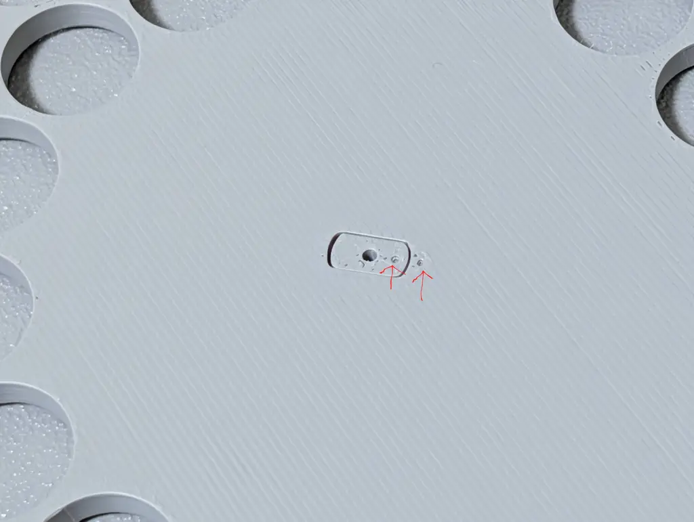

Attach the dial cap from the top and secure it with a screw.

#### Step 4: Wiring

Attach the sensor board and motor driver to the Raspberry Pi Pico.

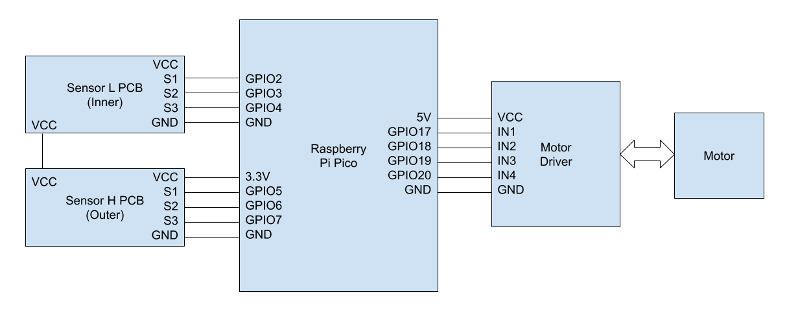

Please check [board assembly guide](./board/README.md) for details.

Secure the board to the edge of the bottom case with double-sided tape or similar.

### 9-Dial Edition

**The 9-dial edition is currently under adjustment.**

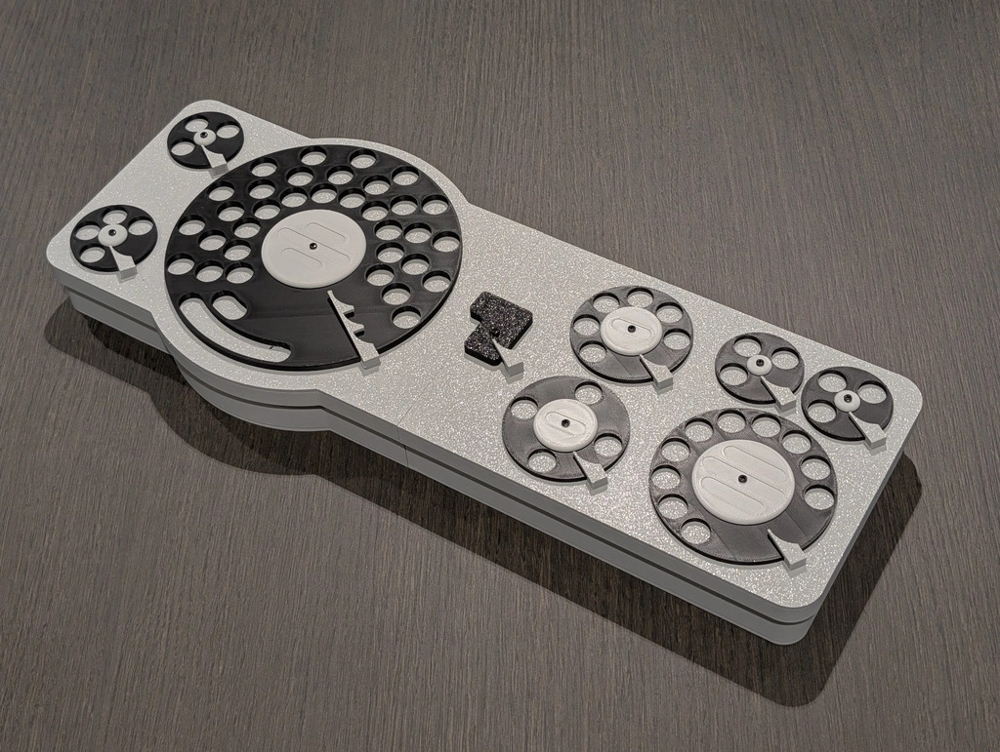

#### Required Parts

- 3D printed parts
  - 1 each of left and right bottom cases
  - 1 each of left and right top cases
  - 9 dials (including the enter key)
  - 9 dial caps
  - 5 types of encoders, 9 in total
    - 1 for 6 bits
    - 1 for 4 bits
    - 3 for 3 bits
    - 3 for 2 bits
    - 1 for 1 bit
  - 9 clutches
  - 2 types of fixing covers, 9 in total
    - 7 small
    - 2 large
  - 3 types of over-rotation prevention claws, 9 in total
    - 8 small
    - 1 triple
- 9 types of encoder patterns
- Screws
  - About 100 self-tapping screws, 2mm diameter, 4mm length
  - 18 washers
  - A few M3 bolts and nuts
- PCB
  - 11 sensor boards
  - 1 main board (assembled)
- Electronic parts ([see the board directory for details](./board/README.md))
  - 1 assembled main board with [2 firmware installed](./firmware/README.md)
  - 11 assembled sensor boards
  - 9 [Unipolar Stepping Motors 28BYJ-48 5V](https://akizukidenshi.com/catalog/g/g113256/)
  - Wiring materials: as needed

### Assembly

#### Step 1: Connect Left and Right

Connect the left and right bottom cases with four M3 screws.

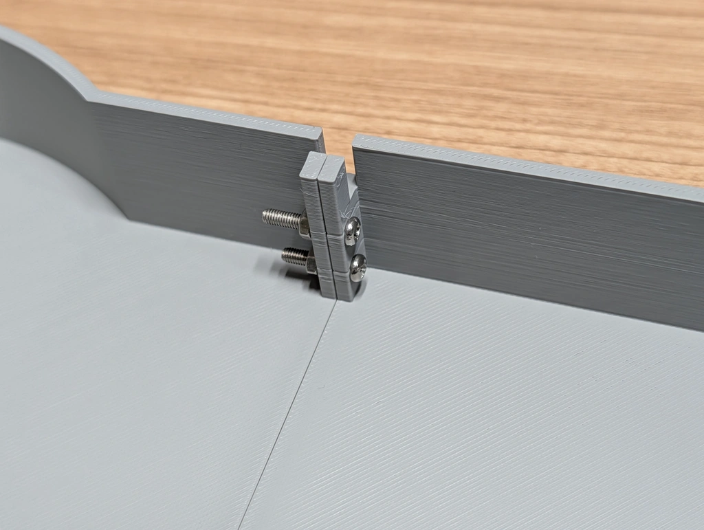

#### Step 2: Create the Encoder

Same as the 1-dial edition.

#### Step 2: Assemble the Cover Module

Basically the same as the 1-dial edition.

Attach only one sensor board to seven of the covers.
Attach two sensor boards to two of the covers.

#### Step 3: Attach to the Case

Basically the same as the 1-dial edition.

#### Step 4: Wiring

Wire the motor and sensor board to the dedicated main board.
