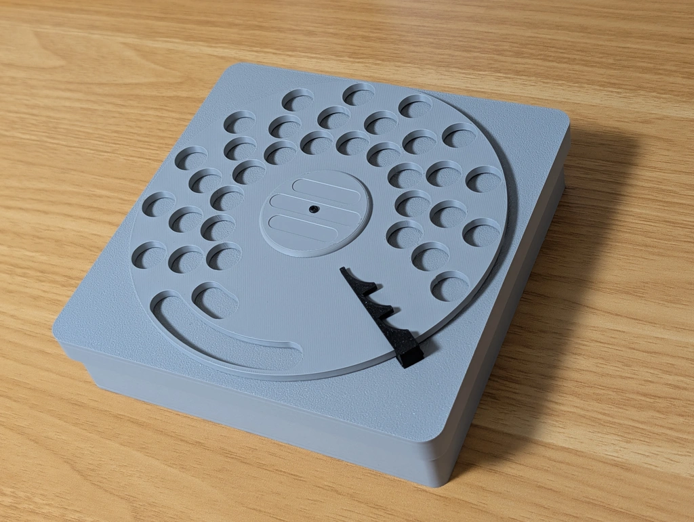
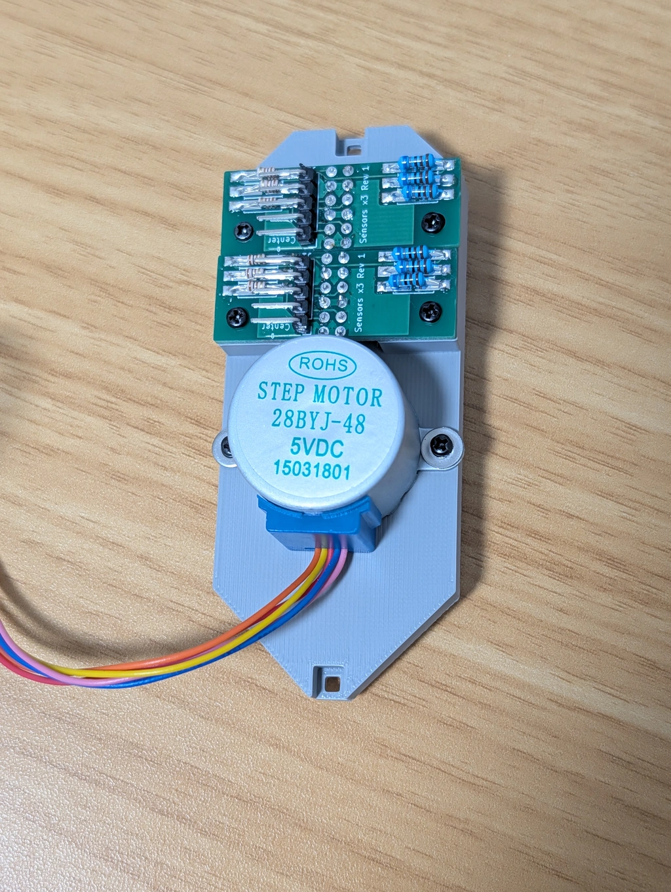

# ビルドガイド

[プロジェクトの概要を先にどうぞ](./README_ja.md)

## ファイル一覧

- stls/ : ケース用の STL ファイル
- stls/one_dial/ : 1ダイヤル版用
- stls/full/ : 9ダイヤル版用（準備中）
- pattern/ : エンコーダ用パーターンファイル
- board/ : KiCad用の回路図と基板のレイアウトデータ
- board/gerber/ : 基板製造用ガーバーデータと組み立て用の配置情報
- firmware/ : Raspberry Pi Pico C/C++ SDK向けファームウェア開発リソース一式
- firmware/prebuilt : コンパイル済みファームウェアバイナリ

## 組みたて

1ダイヤルのみ搭載し、組み立てやすくした、1ダイヤル版と、
9つのダイヤルを搭載した、フル版を用意しています。

### 1ダイヤル版

#### 必要な部品

- 3Dプリント品(各1つ)
  - ケース下面(case_bottom.stl)
  - ケース上面(case_top.stl)
  - ダイヤル(dial.stl)
  - ダイヤルキャップ(dial_cap.stl)
  - エンコーダ(encoder.stl)
  - クラッチ(clutch.stl)
  - 固定用カバー(cover.stl 灰色など白に近い色で印刷)
  - 三連ツメ(end3.stl)
- エンコーダパターン pattern/one_dial.svg
- ねじ類
  - 直径2mm 長さ4mmのセルフタッピングスクリュー 12個
  - ワッシャー2個
- 電子部品([詳細についてはboardディレクトリを参照のこと](./board/README_ja.md))
  - [ファームウエア書き込み済み](./firmware/README_ja.md) Raspberry Pi Pico 1個
  - 組み立て済センサー基板 2枚
  - [ユニポーラー ステッピングモーター 28BYJ-48 5V](https://akizukidenshi.com/catalog/g/g113256/): 1個
  - [モータードライバーモジュール](https://www.aitendo.com/product/12366): 1個
  - 配線材: 適宜

#### Step 1: エンコーダの作成

[パターンファイル](./pattern/one_dial.svg)をコピー用紙に実寸大で印刷する。
印刷面を下にし上からエンコーダ部品をのりで貼り、周辺と中央をカットする。

エンコーダ部品にある◆マークと紙にある▼マークを合わせる。

#### Step 2: カバーモジュールの組み立て

カバーは、フォトセンサーを使う仕組み上、透過しない色で印刷する必要があります。
試作では灰色のPLAで印刷しました。
他の色の場合、センサ基板の抵抗値を調節する必要があるかもしれません。

裏面に、センサ基板2枚をネジ止めします。

同じく裏面にステッピングモータをネジ止めします。

モータに近い側の基板をセンサーL基板、もう1つの基板をセンサーH基板を呼びます。

表面に出てるモータ軸にクラッチをつけます。

#### Step 3: ケースへの取りつけ

裏側から、エンコーダ、そしてカバーを取り付けます。
カバーの向きは下の写真を参考にしてください。

表から軸にダイヤルと、キャップをつけます。
ダイヤルと軸には小さいマークがあるので、マークをあわせます。

上からダイヤルキャップをつけネジで止めます。

#### Step 4: 配線

RaspberryPiPicoにセンサ基板とモータドライバをつけます。

[詳細についてはboardディレクトリを参照のこと](./board/README_ja.md)

基板はケース底面の端に両面テープなどでとめておきます。

### 9ダイヤル版

**9ダイヤル版は現在調整中です。**

#### 必要な部品

- 3Dプリント品
  - ケース下面 左右1つずつ
  - ケース上面 左右1つずつ
  - ダイヤル 9個 (エンターキーを含む)
  - ダイヤルキャップ 9個
  - エンコーダ 5種 計9個
    - 6ビット用 1個
    - 4ビット用 1個
    - 3ビット用 3個
    - 2ビット用 3個
    - 1ビット用 1個
  - クラッチ 9個
  - 固定カバー 2種 計9個
    - 小 7個
    - 大 2個
  - 回転しすぎ防止つめ 3種 9個
    - 小 8個
    - 3連 1個
- エンコーダパターン 9種類
- ねじ類
  - 直径2mm 長さ4mmのセルフタッピングスクリュー 約100個
  - ワッシャー 18個
  - M3ボルトとナット 少々
- 電子部品([詳細については基板組み立てガイドを参照のこと](./board/README_ja.md))
  - 組み立て[ファームウエア書き込み](./firmware/README_ja.md)済みメイン基板 1枚
  - 組み立て済センサー基板 11枚
  - [ユニポーラー ステッピングモーター 28BYJ-48 5V](https://akizukidenshi.com/catalog/g/g113256/): 9個
  - 配線材: 適宜

#### Step 1: 左右の接続

ケース下面の左右をM3ねじ4本で接続します。

#### Step 2: エンコーダの作成

1ダイヤル版と同様です。

#### Step 2: カバーモジュールの組み立て

基本的には1ダイヤル版と同様です。

カバーのうち7つは、センサ基板を1枚だけ組みつけます。
2つは、センサ基板を2枚つけます。

#### Step 3: ケースへの取りつけ

基本的には1ダイヤル版と同様です。

#### Step 4: 配線

専用のメイン基板に、モータとセンサ基板を配線します。
